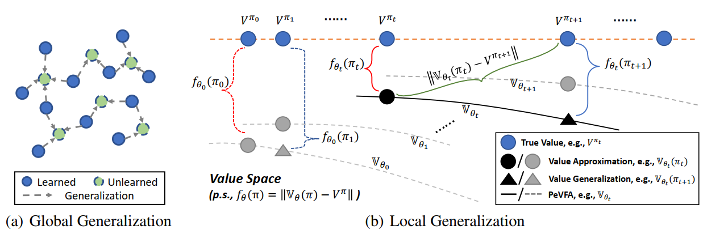

# RL with Action Representation

Action Representation is one major category in our taxonomy. 
The core research content of action representation is to discover or learn **low-dimensional representation for RL policy**, which are beneficial to downstream RL tasks (e.g., policy learning).
In a general view, any decision-making problems which involves multiple policies or a policy optimization process, can be the potential downstream tasks of policy representation.

In our opinion, RL with Policy Representation contains the research on:
- **What an optimal policy representation should be like.**
- **How to obtain or learn desired policy representation in specific cases.**
- **How to make use of policy representation to develop and improve RL in different ways.**

## Repo Content

This repo contains representative research works of TJU-RL-Lab on the topic of RL with Policy Representation.
Currently, we focus on how policy representation can improve policy learning process in a general way.

## An Overall View of Research Works in This Repo  

This repo will be constantly updated to include new researches made by TJU-RL-Lab. 
(The development of this repo is in progress at present.)

| Method | Is Contained | Is ReadME Prepared | Author | Publication | Link |
| ------ | --- | --- | ------ | ------ | ------ |
| HyAR | ✅ | ❌ | Boyan Li  | ICLR 2022 | https://openreview.net/forum?id=64trBbOhdGU |

## Installation

The algorithms in this repo are all implemented **python 3.5** (and versions above). **Tensorflow 1.x** and **PyTorch** are the main DL code frameworks we adopt in this repo with different choices in different algorithms.

Note that the algorithms contained in this repo may not use all the same environments. Please check the README of specific algorithms for detailed installation guidance.

## TODO
- [ ] Update README file for HyAR
- [ ] Tidy up code of HyAR

## Related Work

Here we provide a useful list of representative related works on policy representation and policy-extended value functions.

- Boyan Li, Hongyao Tang, Yan Zheng, Jianye Hao, Pengyi Li, Zhen Wang, Zhaopeng Meng, Li Wang. HyAR: Addressing Discrete-Continuous Action Reinf
orcement Learning via Hybrid Action Representation. ICLR 2022
- Wenxuan Zhou, Sujay Bajracharya, David Held. PLAS: Latent Action Space for Offline Reinforcement Learning. CoRL 2021
- William F. Whitney, Rajat Agarwal, Kyunghyun Cho, Abhinav Gupta. Dynamics-Aware Embeddings. ICLR 2020
- Yash Chandak, Georgios Theocharous, James Kostas, Scott M. Jordan, Philip S. Thomas. Learning Action Representations for Reinforcement Learning.
ICML 2019
